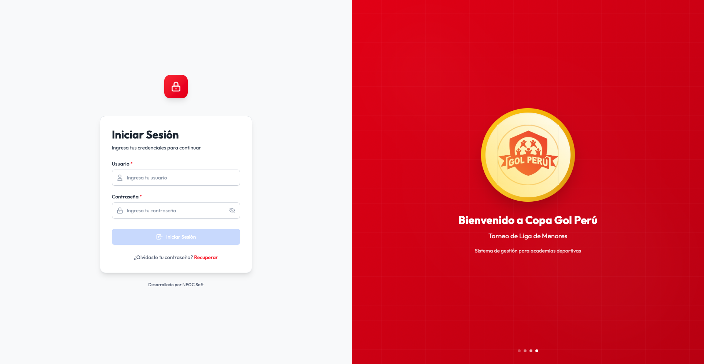
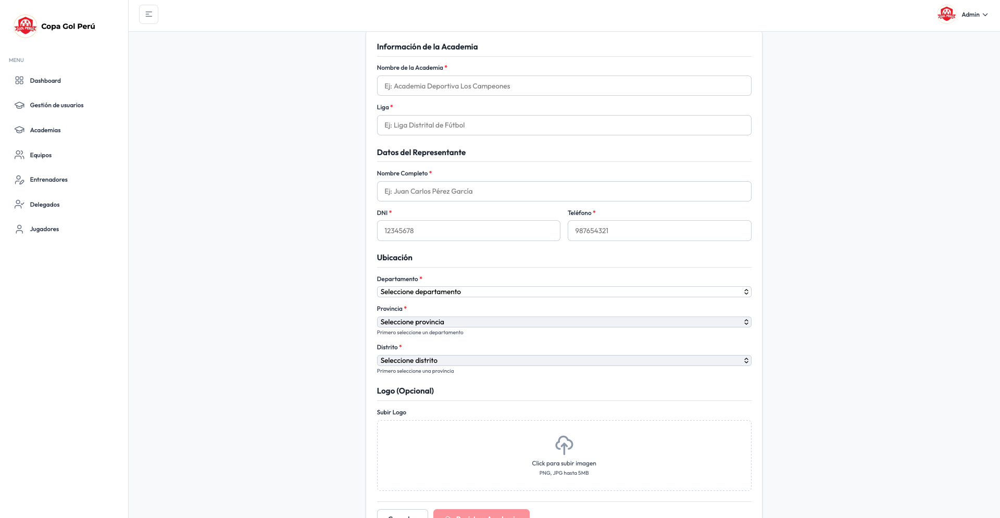
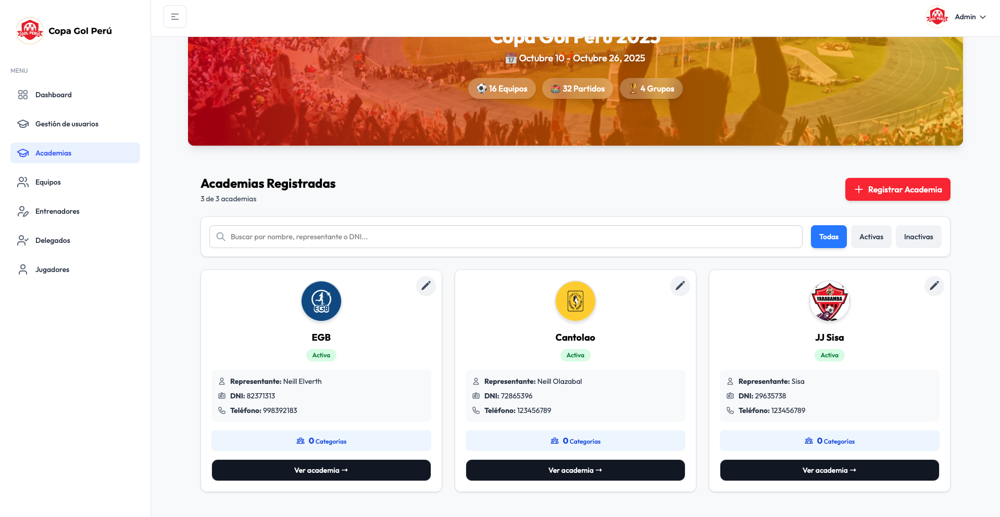
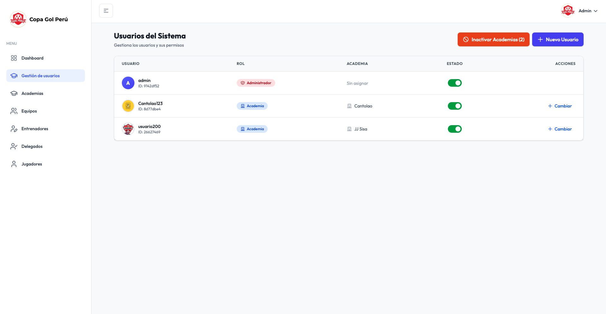

# Sistema de Gestión de Torneos - Frontend

> **Interfaz administrativa para la gestión de campeonatos de fútbol en tiempo real para Copa Gol Perú.**
> **Live Demo:** [Acceder al Sistema Desplegado](https://copagolperu.com).
* **Nota de Acceso:** Por motivos de seguridad y privacidad de los datos, el acceso al panel administrativo está restringido. Le invito a revisar la sección de **Galería de Imágenes** para visualizar el funcionamiento interno y el flujo de usuario.

## Descripción

Este repositorio contiene el código fuente del **Frontend** (Cliente Web) del Sistema de Gestión de Torneos para **Copa Gol Perú**. Diseñado como una *Single Page Application (SPA)* moderna, permite a los administradores gestionar academias, torneos y usuarios de forma eficiente.

## Stack Tecnológico & Herramientas

La arquitectura del frontend se centra en el rendimiento, la escalabilidad y la experiencia de desarrollo:

* **Core:** React 18 + TypeScript + Vite.
* **Estilos & UI:** Tailwind CSS + **[TailAdmin Template]**.
* **Gestión de Medios:** **Cloudinary API** (Optimización y almacenamiento de imágenes en la nube).
* **Infraestructura & CI/CD:** Desplegado en **Vercel** (Edge Network).
* **Gestión de Formularios:** React Hook Form.
* **Conexión API:** Axios.

> **Nota Técnica:** 
> * **Imágenes:** Se implementó una integración directa con la API de Cloudinary para evitar sobrecargar el servidor backend, permitiendo la subida y redimensionamiento automático de los logos de equipos y fotos de jugadores.
> * **UI:** Se utilizó la plantilla *TailAdmin* como base para la estructura del dashboard.

## Galería de la Interfaz

A continuación se presentan las vistas principales del panel administrativo:

### 1. Acceso y Visión General
| Login del Sistema |
|:---:|
|  |  |

### 2. Gestión de Academias
| Formulario de Registro (React Hook Form) | Cards Academias |
|:---:|:---:|
|  |  |

### 3. Administración
| Gestión de Usuarios |
|:---:|
|  |

*(Nota: Las imágenes son referenciales del entorno de desarrollo)*

## Integración Backend

Este frontend requiere que el servidor API esté en ejecución para funcionar correctamente.
**[Ver Repositorio del Backend](https://github.com/neill04/copagolperu)**

---
© 2026 Developed by **NEOC Soft**.
*Based on TailAdmin React Free Template.*